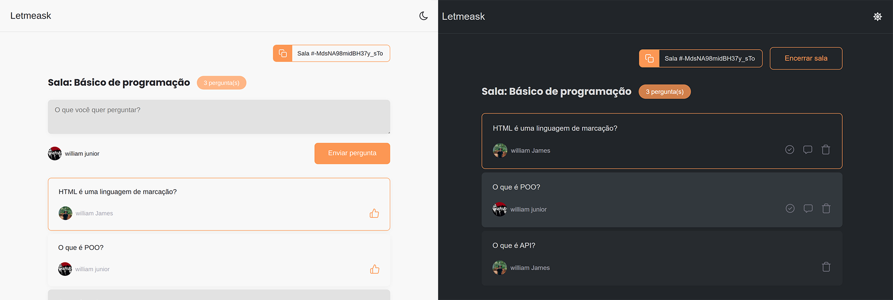

<br />
<p align="center">

  <h3 align="center">Letmeask</h3>

  <p align="center">
   Letmeask é uma plataforma onde é possível criar salas de Q&A.
  </p>
</p>

<details open="open">
  <summary>Índice</summary>
  <ol>
    <li>
      <a href="#sobre-o-projeto">Sobre o projeto</a>
      <ul>
        <li><a href="#construido-com">Construido com</a></li>
      </ul>
    </li>
    <li>
      <a href="#começando">Começando</a>
      <ul>
        <li><a href="#pre-requisitos">Pré-requisitos</a></li>
        <li><a href="#instalação">instalação</a></li>
      </ul>
    </li>
    <li><a href="#licença">Licença</a></li>
    <li><a href="#contato">Contato</a></li>
  </ol>
</details>

## Sobre o projeto



<br />
Letmeask é perfeito para criadores de conteúdos poderem criar salas de Q&A com o seu público, de uma forma muito organizada e democrática.

Este é um projeto desenvolvido durante a Next Level Week Together, apresentada dos dias 20 a 27 de Junho de 2021.

#### Minhas melhorias:

- Adicionei toastify para mensagens de erros;
- Adicionei rotas privadas, assim apenas o dono da sala pode entrar como administrador;
- Adicionei a opção de Dark Mode;
- Deixei o layout total responsivo;
- Fiz com que as perguntas que foram marcadas como “respondidas” sejam movidas para o final e as perguntas marcadas como “sendo respondida” são movidas para o início.

#### Demo

Acesse a versão demo nesse link e utilize o seguinte código para acessar a sala de teste.

```sh
  -MdsNA98midBH37y_sTo
```

### Construído com

O projeto foi construído utilizando

- [Reactjs](https://reactjs.org)
- [Firebase](https://firebase.google.com)
- [TypeScript](https://www.typescriptlang.org)

# Começando

Para obter uma cópia local desse repositório, siga estas etapas.

### Pré-requisitos

Para usar esse repositório, são necessários os seguintes softwares:

- yarn

  Baixe e instale a versão mais recente do [yarn](https://classic.yarnpkg.com/en/docs/install/).

  Instalar via npm

  ```sh
  npm install --global yarn
  ```

  Instalar via Chocolatey

  ```sh
  choco install yarn
  ```

### Instalação

1. Clone esse repositório:
   ```sh
   git clone https://github.com/william-james-pj/Letmeask-NLW06.git
   ```
2. Na raiz do projeto, instale todas as dependências definidas no package.json:
   ```sh
   yarn
   ```
3. Inicie o projeto:
   ```sh
   yarn start
   ```

O app estará disponível no seu browser pelo endereço http://localhost:3000.

Lembrando que será necessário criar uma conta no Firebase e um projeto para disponibilizar um Realtime Database.

## Licença

Distribuído sob a licença MIT. Veja `LICENSE` para maiores informações.

## Contato

William James - william.james.pj@gmail.com

Link do projeto: [https://github.com/william-james-pj/Letmeask-NLW06](https://github.com/william-james-pj/Letmeask-NLW06)
